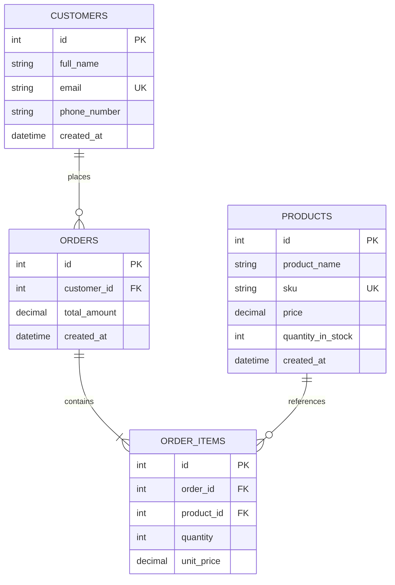

# Nexus | Premium Inventory & Order Management System

Welcome to **Nexus**, a complete, production-ready, fully containerized Inventory & Order Management System. This project integrates a robust **Python FastAPI** backend, a stunning glassmorphism **React** SPA, and an ACID-compliant **PostgreSQL** relational database.

---

## 🛠️ Technology Stack
- **Backend API**: Python 3.11, FastAPI (for automatic schemas, validation, and high performance), SQLAlchemy ORM, Uvicorn ASGI server.
- **Frontend SPA**: React (Vite-powered SPA, optimized static compilations), Custom Glassmorphic Dark UI (pure CSS styling, dynamic reactive states, and notifications).
- **Database**: PostgreSQL (strict foreign-key constraints enforced at database layer, relational integrity protections).
- **Orchestration**: Docker & Docker Compose (multi-stage optimized production builds, persistent named volumes).

---

## 📊 Database Model Diagram



---

## ⚙️ Core Business Logic Rules
1. **Uniqueness**: Product `sku` and Customer `email` are enforced unique at the database column index level. Attempting to insert duplicates throws explicit validation errors.
2. **Strict Non-Negativity**: Product `price` must be strictly greater than `0.00`. Inventory `quantity_in_stock` must be non-negative.
3. **Atomic Stock Check**: Orders cannot be placed if the requested quantity exceeds the available `quantity_in_stock` for *any* item inside the order.
4. **Auto Stock Adjustment**: Placing a successful order automatically deducts the respective items' quantities from inventory.
5. **Calculated Order Totals**: The backend automatically multiplies each item's current wholesale price by its ordered quantity to generate a immutable `total_amount` for the transaction.
6. **Graceful Cancellation**: Deleting or cancelling an order automatically recovers all allocated items, increasing `quantity_in_stock` back to its original status before checkout.

---

## ⚡ Quick Start: Local Run with Docker Compose

Running the entire ecosystem takes a single command:

### 1. Prerequisite
Ensure you have [Docker Desktop](https://www.docker.com/products/docker-desktop/) installed and running.

### 2. Startup
Navigate to the root directory and boot up the containers:
```bash
docker compose up --build
```

### 3. Open Services
- **React Frontend**: [http://localhost:3000](http://localhost:3000)
- **FastAPI Documentation & Swagger UI**: [http://localhost:8000/docs](http://localhost:8000/docs)
- **PostgreSQL Database Engine**: Exposed on port `5432` locally (credentials: `postgres` / `postgres`).

---

## 📋 API Endpoints Reference

### 📦 Product Management
| HTTP Method | Route | Description |
| :--- | :--- | :--- |
| **POST** | `/products` | Register a new SKU in inventory. Validates pricing and stock. |
| **GET** | `/products` | Retrieve all current products. |
| **GET** | `/products/{id}` | Fetch specific product detail by unique identifier. |
| **PUT** | `/products/{id}` | Modify parameters (Name, SKU, Price, Stock) of a product. |
| **DELETE**| `/products/{id}` | Delete a product. Prevented if linked to existing orders. |

### 👥 Customer CRM
| HTTP Method | Route | Description |
| :--- | :--- | :--- |
| **POST** | `/customers` | Register a customer profile. Enforces unique email formatting. |
| **GET** | `/customers` | Fetch complete client directory. |
| **GET** | `/customers/{id}`| Fetch specific customer account parameters. |
| **DELETE**| `/customers/{id}`| Delete a client. Blocked if active billing orders exist. |

### 🧾 Order & Transaction Management
| HTTP Method | Route | Description |
| :--- | :--- | :--- |
| **POST** | `/orders` | Places a multi-item order. Adjusts stock levels automatically. |
| **GET** | `/orders` | Fetch complete billing/invoice history. |
| **GET** | `/orders/{id}` | Inspect order items breakdown details. |
| **DELETE**| `/orders/{id}` | Cancel/delete an invoice. Restores product stocks automatically. |

### 📈 System Metrics
| HTTP Method | Route | Description |
| :--- | :--- | :--- |
| **GET** | `/dashboard/metrics` | Gathers total products, clients count, order totals, and warnings lists. |

---

## ☁️ Deployment Guidelines

Here are the optimal, free platform configurations to push this system live:

### 🗄️ 1. Database (PostgreSQL)
Deploy on **Neon.tech** or **Railway.app** (Postgres Addon):
1. Spawn a Postgres cluster.
2. Secure your connection URI string: `postgresql://<user>:<pwd>@<host>/<database>`.

### 🐍 2. Backend API (FastAPI)
Deploy on **Render.com** (Web Service):
- **Repository**: Select your repo.
- **Environment**: Python
- **Build Command**: `pip install -r backend/requirements.txt`
- **Start Command**: `uvicorn app.main:app --host 0.0.0.0 --port $PORT`
- **Environment Variables**:
  - `DATABASE_URL`: *Your Live Postgres URI string*
  - `PORT`: `8000`

### 💻 3. Frontend (React SPA)
Deploy on **Vercel.com** or **Netlify.com**:
- **Framework Preset**: `Vite`
- **Root Directory**: `frontend`
- **Build Command**: `npm run build`
- **Output Directory**: `dist`
- **Environment Variables**:
  - `VITE_API_URL`: *Your deployed Render.com API URL (e.g. `https://nexus-api.onrender.com`)*
